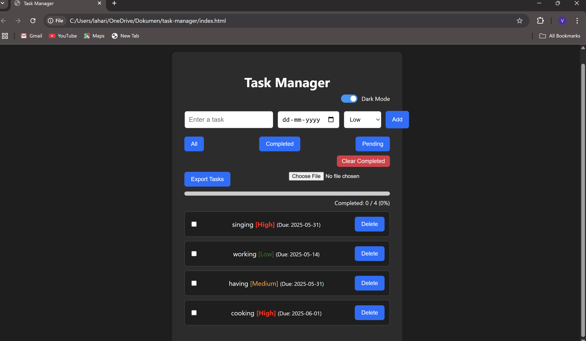

# 📝 Task Manager Web App

A fully responsive and feature-rich task manager web application built using HTML, CSS, and JavaScript. This app helps users create, manage, and track their tasks efficiently with priority tagging, due dates, filtering, and a progress bar — all in the browser using localStorage. Includes light/dark mode and export/import support.

## 🌟 Features

- ✅ Add, edit, delete tasks
- 📅 Set due dates
- 🔴 Priority tags (High / Medium / Low)
- 🔍 Task filters: All / Completed / Pending
- 📊 Real-time progress bar
- ☀️🌙 Light and Dark mode toggle
- 💾 LocalStorage for saving tasks
- 📤 Export / Import tasks as `.json` file
- ↕️ Drag and drop task reordering (using Sortable.js)
- ❗ Confirmation before deleting tasks

## 🛠 Tech Stack

- **HTML5**
- **CSS3**
- **JavaScript**
- **Sortable.js** (for drag and drop)
- **GitHub Pages** for deployment

## 🔗 Live Demo

👉 [View Task Manager Live](https://lahari360.github.io/task-manager/)

## 📸 Screenshot



## 📂 Folder Structure
```
task-manager/
│
├── index.html
├── style.css
├── script.js
└── assets/
    └── screenshot.png
```


